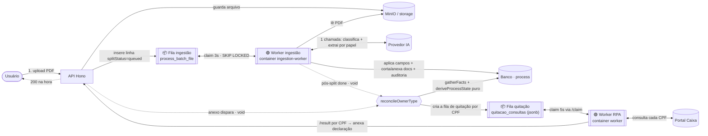
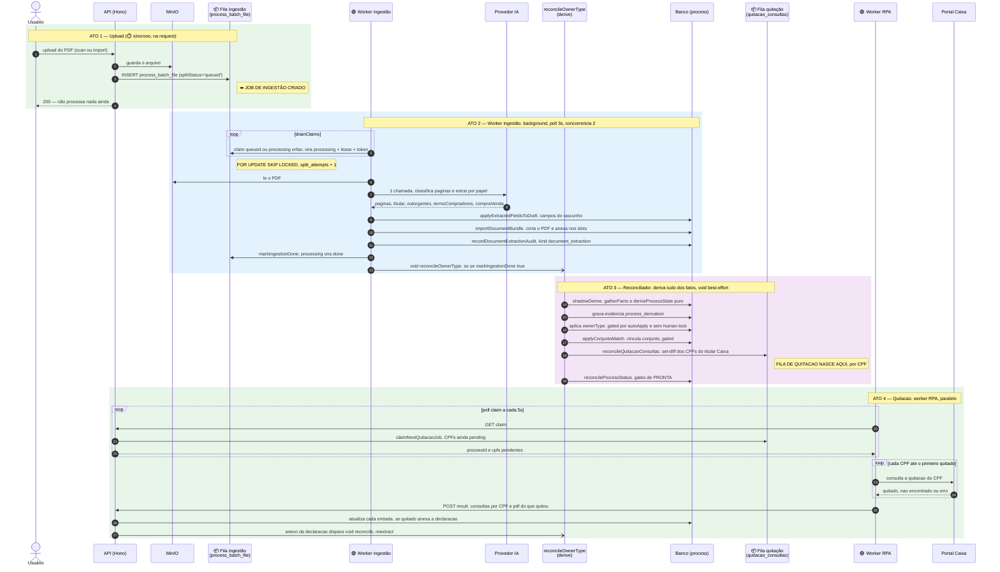
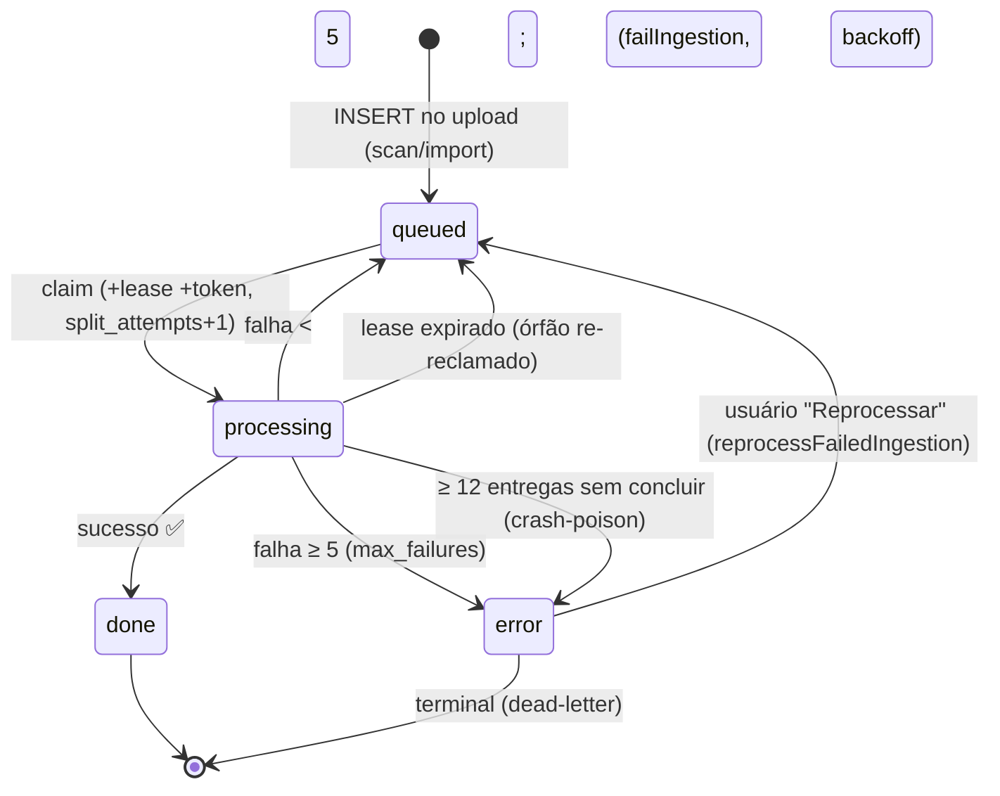
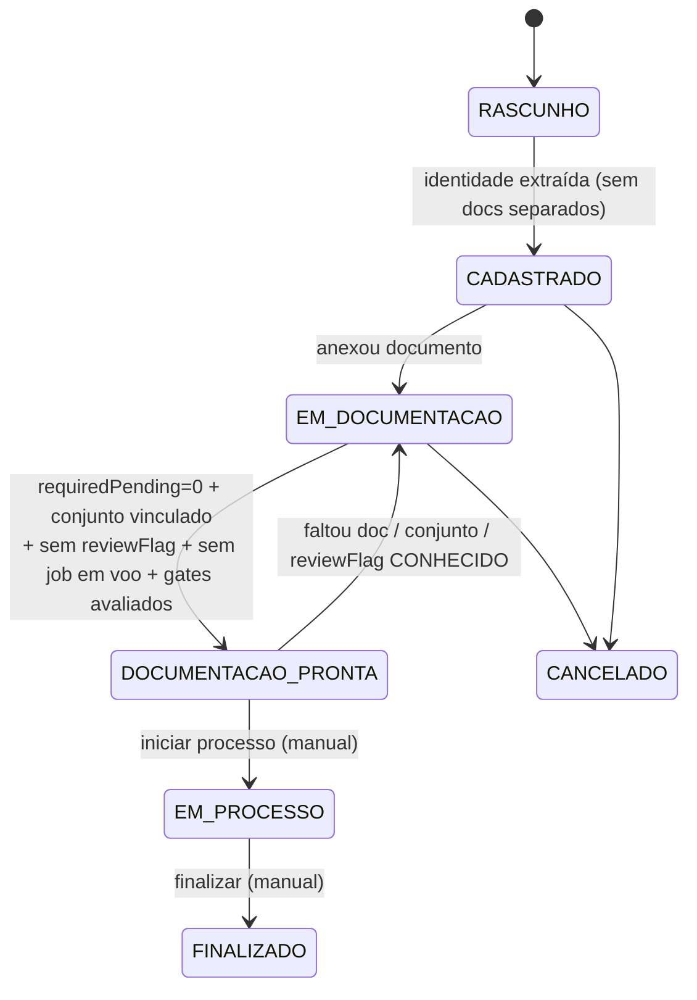
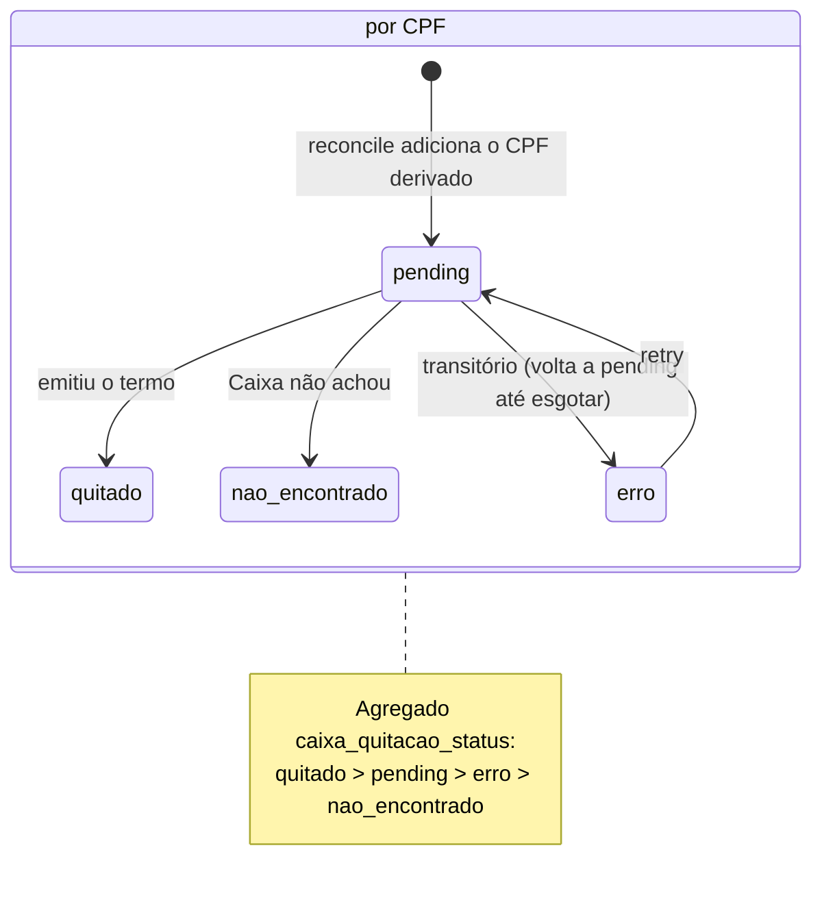
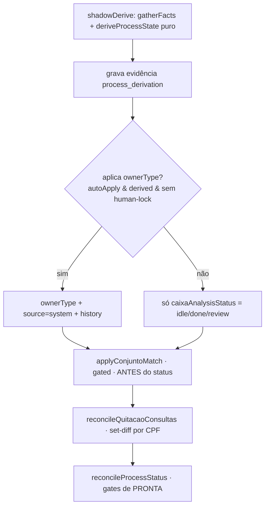
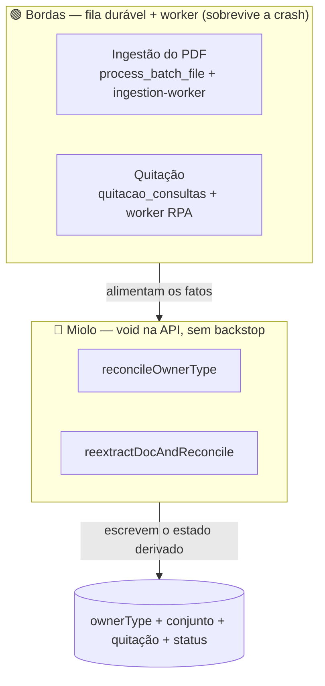

# Fluxo de ingestão de PDF — pipeline do processo

> Documento conferido contra o **código atual** (`api/src/...`, `worker/src/...`),
> não contra comentários. Mostra o caminho do PDF desde o upload até o processo ter
> `ownerType`, conjunto, quitação e status derivados — marcando **quando cada job/
> fila nasce**, o que é **síncrono** vs **assíncrono**, e o que é **durável**
> (sobrevive a crash) vs **frágil** (`void`).
>
> Diagramas em [Mermaid](https://mermaid.js.org) (renderizam no preview do VS Code
> com *Markdown Preview Mermaid Support*, e no GitHub).

## Legenda

| Símbolo | Significado |
|---|---|
| 🟢 **durável** | tem fila no banco + worker que re-tenta; sobrevive a crash/restart |
| 🔴 **frágil** | disparado `void` (fire-and-forget) na API; se falhar, **não há backstop** que re-dispare |
| ⏱️ **síncrono** | aguardado (`await`) dentro do fluxo de quem chama |
| 🔁 **assíncrono** | processo/loop separado, ou `void` |
| 📦 **fila** | estado durável no Postgres de onde um worker puxa trabalho |

---

## 1. Visão geral (quem fala com quem)

> **Não há mais** análises detached separadas de *caixa-owner* nem *procuração-
> conjunto*. Uma **única** extração de IA na ingestão já traz todos os papéis
> (titular, outorgantes, compradores do termo, compra-venda); o resto é **derivado**
> dos fatos. Anexos avulsos disparam a **mesma** extração (`reextractDocAndReconcile`).

---

## 2. Sequência detalhada — quando nasce cada job e fila

---

## 3. Estados da **fila de ingestão** (`process_batch_file.splitStatus`)

Fatos do código (`processes.ingestion.queue.ts`):
- **claim** (`claimNextIngestionJob`): pega `queued` elegível (sem lease/expirado, respeita backoff) **ou** `processing` órfão (lease expirado); `FOR UPDATE SKIP LOCKED`, `ORDER BY split_updated_at`. Incrementa **`split_attempts`** (entregas) e gera **novo fencing token**.
- **fencing token**: `markIngestionDone`/`failIngestion`/`deadLetterIngestion` só aplicam se o token ainda é o do worker — se perdeu o lease, casa 0 linhas e vira no-op (seguro com várias réplicas).
- **dois contadores**: `split_attempts` (entregas/claims) ≠ `split_failure_count` (falhas reais). `failIngestion` incrementa só o de falhas; órfão re-reclamado **não** consome orçamento de retry.
- **constantes**: `MAX_FAILURES=5`, `MAX_DELIVERIES=12`, lease `5min`, heartbeat `TTL/3`, backoff `30s·3^(n-1)` com teto `10min`.
- **worker** (`worker.ts`): poll `3s`, concorrência `2`, container `ingestion-worker` (`bun run worker`).

---

## 4. Estados do **processo** (fase de negócio)

Gates de PRONTA (`syncProcessStatusAfterChecklistChange`):
- `checklistComplete = requiredPending === 0 && housingComplexId !== null`.
- `!reviewBlocked` (sem `reviewFlags`) e `!readinessPending` (nenhum job exigido em voo).
- **FAIL-CLOSED**: se a derivação dos gates lança, `gatesEvaluated=false` → **não promove** e **não reverte** um PRONTA existente (anti-flapping).
- **Reverte** PRONTA só por incompletude CONHECIDA (faltou doc, conjunto desvinculado, ou reviewFlag). `readinessPending` (job em voo) **não** reverte.

> `EM_DOCUMENTACAO` é exibido como **"Documentação pendente"**; *"Processando"* é badge de readiness, não fase.

---

## 5. Estados da **quitação** — por CPF (`quitacao_consultas` jsonb)

O titular do contrato Caixa pode ser **1–2 CPFs** (titular + cônjuge/co-comprador, ou os vendedores). Cada CPF tem seu próprio estado terminal.

Fatos do código:
- `reconcileQuitacaoConsultas` (`derive/reconcile.ts`) faz **set-diff**: CPF novo → `pending`; CPF que continua → **preserva** a entrada (não re-consulta um terminal só porque o conjunto mudou); CPF removido → sai. Re-enfileira (zera attempts) só quando o agregado vira `pending`.
- **claim** (`claimNextQuitacaoJob`) devolve **a lista de CPFs `pending`** (não 1). Sem fallback para `process.cpf`.
- **worker RPA** (`worker/src/index.ts`): itera os CPFs, **para no 1º `quitado`** (short-circuit), guarda o PDF dele; reporta `/result` como `consultas[]` por CPF.
- `recordQuitacaoResult` atualiza por CPF (`nextConsultaStatus`) e preserva os demais; um `quitado` cujo **anexo da declaração falha NÃO vira terminal** — volta a `pending` (idempotente) até esgotar as tentativas (`MAX_ATTEMPTS=6`).

---

## 6. Onde/quando nasce **cada job e cada fila**

| Trabalho | "Fila" (onde vive) | Criado **quando** | Por quem (código) | Pego por |
|---|---|---|---|---|
| **Ingestão do PDF** | `process_batch_file.splitStatus='queued'` 📦 | no **upload** (scan/import) | `storeIngestionFile` / `completeDocumentImport` | `ingestion-worker` (poll 3s) 🟢 |
| **Reconciliação** (ownerType + conjunto + status + fila de quitação) | — (não é fila; `void`) | após **split `done`**; e em **cada anexo** de doc relevante; e na reanálise | `reconcileOwnerType` (via `reextractDocAndReconcile`) 🔴 | a própria **API**, `void` |
| **Quitação** | `process.quitacao_consultas` (jsonb por CPF) + `caixa_quitacao_status='pending'` 📦 | quando o **reconciliador deriva o(s) titular(es) do contrato Caixa** | `reconcileQuitacaoConsultas` | `worker` RPA (poll 5s via `/claim`) 🟢 |

> **Não existem** `enqueueQuitacaoCheck`, `startCaixaOwnerAnalysis` nem
> `startProcuracaoConjuntoAnalysis` — foram removidos. A ingestão **não** enfileira
> quitação; quem cria a fila é o reconciliador, só quando o titular Caixa é conhecido.

---

## 7. O reconciliador (`reconcileOwnerType`) — sequência

`void`/best-effort (nunca lança). Disparado pós-split (em `processClaimedIngestion`, após `markIngestionDone`) e por `reextractDocAndReconcile` (anexo de termo/declaração/procuração, e reanálise).

`gatherFacts` lê: linha `process`, `splitStatus` (job em voo), audits `document_extraction` (fonte primária dos papéis) + `caixa_owner` legado (fallback), checklist, e `housing_complex` (match do conjunto). `deriveProcessState` é **puro** e devolve `ownerType`, `quitacaoSubjects`, `requiredDocs`, `status` e `reviewFlags` (objetos `{code, titulo, detalhe, docKey}`). O checklist (`getProcessChecklist`) **expõe** os `reviewFlags` para o banner de pendências.

---

## 8. Robusto × frágil (a leitura honesta)

- **Bordas (🟢):** ingestão (fila `process_batch_file` + `ingestion-worker`) e quitação (`quitacao_consultas` + worker RPA) usam **fila + worker** — se cair, re-tentam sozinhas.
- **Miolo (🔴):** `reconcileOwnerType` e `reextractDocAndReconcile` rodam **`void` na API**, **sem backstop**. Se o gatilho se perder (crash entre `markIngestionDone` e o reconcile, ou promise rejeitada), o processo fica **"certo no cálculo, mas vazio no banco"** — e **abrir o processo não re-deriva**. O conserto estrutural pendente é **derivar na leitura** (ou um sweep level-triggered). Ver [`arch-process-derivation-v3`].

> Nota: existe um caminho **legado** de split inline (`startBatchFileSplit`/
> `runBatchFileSplit`, `void` + `setSplitStatus`) fora da fila durável; o fluxo atual
> de scan/import usa a **fila** descrita aqui.
